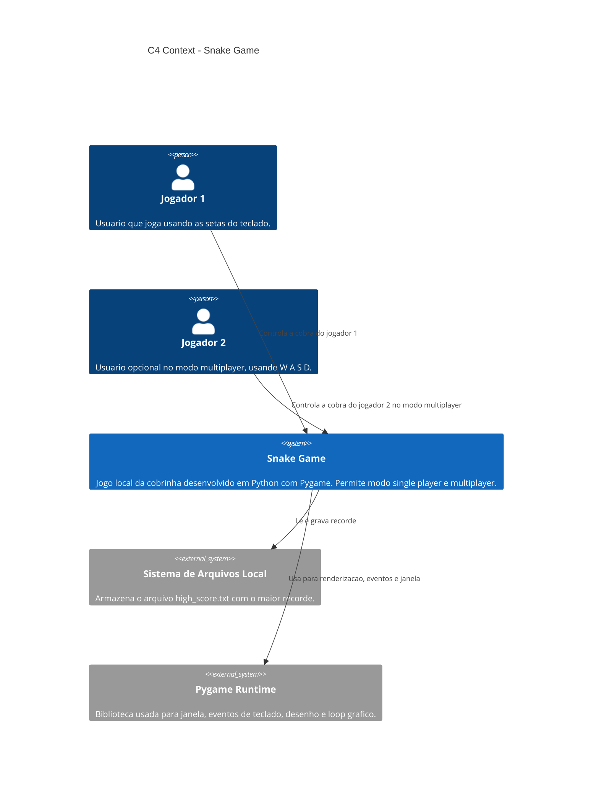
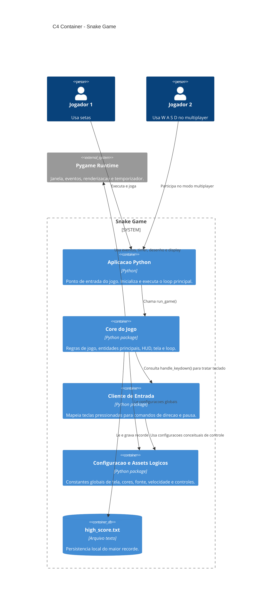
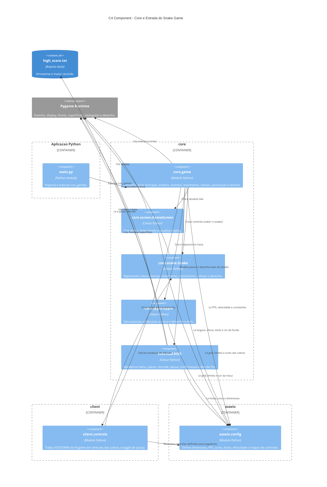

# Arquitetura C4 - Snake Game

Este documento descreve a arquitetura do projeto usando o modelo C4 nas camadas Context, Container e Component.

Nao inclui a camada Code.

## 1. Context

### Responsabilidades

- O jogador interage com o jogo por teclado.
- O jogo controla estados como menu, partida, pausa, confirmacao de saida e fim de jogo.
- O Pygame fornece a infraestrutura grafica e de entrada.
- O sistema de arquivos local persiste o high score em `high_score.txt`.

## 2. Container

### Containers do projeto

- `main.py`: ponto de entrada da aplicacao.
- `core`: pacote principal com loop, entidades, HUD e tela.
- `client`: pacote de entrada do usuario, hoje focado em teclado.
- `assets`: pacote de configuracao, cores, dimensoes e constantes.
- `high_score.txt`: arquivo gerado em runtime para salvar o recorde.

## 3. Component

### Componentes principais

- `core.game`: orquestrador da aplicacao. Decide modo single/multiplayer, processa eventos, move as cobras, verifica colisao e escolhe vencedor ou game over.
- `core.snake.Snake`: entidade da cobra. Controla posicao, direcao atual, direcao pendente, crescimento e colisoes.
- `core.apple.Apple`: entidade da maca. Sorteia posicao livre no grid e renderiza a maca.
- `core.hud.HUD`: interface textual. Desenha menu de modo, placares, recorde, pausa, confirmacao e fim de jogo.
- `core.screen.GameScreen`: encapsula a janela do Pygame.
- `client.controls`: traduz entrada de teclado em comandos do jogo.
- `assets.config`: centraliza constantes compartilhadas.

## Observacoes arquiteturais

- A arquitetura atual e modular e simples, adequada ao tamanho do projeto.
- O `core.game` concentra a maior parte da orquestracao e regras de fluxo.
- O projeto ja separa entrada (`client`), configuracao (`assets`) e dominio/renderizacao (`core`).
- `assets.config` possui mapas de controle declarados, mas o mapeamento efetivo esta em `client.controls`.
- O arquivo `high_score.txt` e uma dependencia de runtime, gerada quando um novo recorde e salvo.
